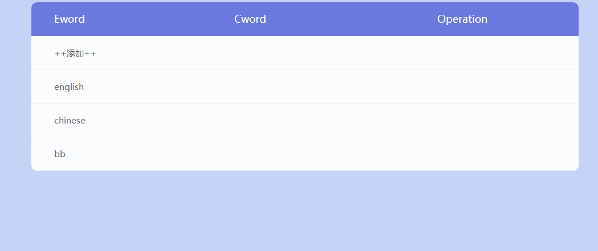

# EWords
I had a project named EWords several years ago, it's used to learn english words.
Unfortunately I lost it, I'd like to resetup it and as a chance with the new knowledge.

## Run Enviroment
You could run the project with `mvn jetty:run` or just `jetty:run` when run with maven in eclipse.

You could also run the maven `clean install` to generate the war file and deploy it to the Tomcat manually.

I use `Sqlite3` instead of `Mysql`, so that it's easy to be moved.

**Note:** please config Tomcat `reloadable='false'`, otherwise an exception `illegal access` may be thrown at runtime.

## Demo

## Update Plan&Log:
- [ ] Use Vue.js or ReactJS and Update UI
- [ ] Use Mybatis instead of original JDBC
- [x] Remove unneed folders(e.g. target/, logs/)
- [x] Remove not used static resource(e.g. fonts/select2.js/bootstrap/...)
- [x] Setup Project
